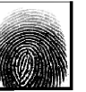
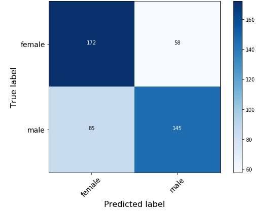

# Gender classification based on fingerprint images

## Description

The Sokoto Coventry Fingerprint Dataset (SOCOFing), available at https://www.kaggle.com/ruizgara/socofing, was used for this project. The aim of this project is to use fingerprint images to classify gender. Transfer learning was applied using the following architectures: [VGG-16](https://keras.io/api/applications/vgg/#vgg16-function), [ResNet-18](https://github.com/qubvel/classification_models), and [ResNet-34](https://github.com/qubvel/classification_models).

The goal was to improve upon the 75.2% accuracy achieved by [(Shehu et al., 2018)](https://ieeexplore.ieee.org/document/8614212). To find improvements additional pre-processings steps are taken, data augmentation is applied, and Bayesian optimization is used to find the best hyperparameters.

## Procedure

### Pre-processing

First an enhanced dataset was created by applying Gabor filters to improve the quality of the fingerprint images. For this process source code from [Fingerprint-Enhancement-Python](https://github.com/Utkarsh-Deshmukh/Fingerprint-Enhancement-Python) was used. (see pre-processing folder of this repository for slight modifications made) 

Below an example of what an enhanced image look like after applying the Gabor filters.

|            Regular              |            Enhanced              |
|:-------------------------------:|:--------------------------------:|
|||

### Dataset - training, validation, and test split

The dataset consists out of 6,000 fingerprint images from 600 people. From these images, 4770 belong to male subjects and 1230 to female subjects. Undersampling has been applied to create a balanced data set containing 1230 images for both classes. This balanced dataset is divided in a training, validation, and test split with 700, 300, and 230 images of each class respectively. 

### Experimental set-up

Both the enhanced and the regular dataset were used to train each of the models mentioned above. Furthermore, all models were also trained with and without data augmentation (see augmentation examples below). In total 12 models were trained. During the training process [`hyperopt`](https://github.com/hyperopt/hyperopt) was leveraged to apply Bayesian optimization. The tuning process and hyperparameter settings will be discussed below.

### Data augmentation

Example of the data augmentation procedure:

|            Regular              |             Regular Augmented             |             Enhanced             |               Enhanced Augmented             |
|:-------------------------------:|:-----------------------------------------:|:--------------------------------:|:---------------------------------------------------:|
|||||

### Tuning
For tuning the models, 20 trials were used and each trial consisted of 50 epochs with early stopping (patience = 5). Validation accuracy was used as the performance metric during training. The following parameters were being optimized for using Bayesian optimization (see: *notebooks/helper-functions.py* for source code):
* `trainable`          - whether layers of the pre-trained networks are trainable or not
* `dense_layers`       - number of additional dense layers added to pre-trained network
* `dense_hidden_size`  - number of neurons in the additional dense layers
* `dropout_rate` 
* `l1_reg`
* `l2_reg`
* `optimizer_function`
* `learning_rate`

After finding the best parameters with `hyperopt`, manual tuning was applied to investigate if training for 100 epochs would improve results or to correct for overfitting. The exact training process and final parameter settings for all models can be found in the notebooks listed in the *notebooks/training-models* directory.

## Results 

The table below contains the validation and test accuracies for all of the trained models.

The best performing model is VGG-16 trained on the regular dataset using data augmentation with 68.91% accuracy.

<table>
<thead>
  <tr>
    <th rowspan="2"> Model</th>
    <th colspan="4">Data augmentation</th>
    <th colspan="4">No data augmentation</th>
  </tr>
  <tr>
    <td colspan="2">Regular dataset</td>
    <td colspan="2">Enhanced dataset</td>
    <td colspan="2">Regular dataset</td>
    <td colspan="2">Enhanced dataset</td>
  </tr>
</thead>
<tbody>
  <tr>
    <td></td>
    <td>Validation</td>
    <td>Test</td>
    <td>Validation</td>
    <td>Test</td>
    <td>Validation</td>
    <td>Test</td>
    <td>Validation</td>
    <td>Test</td>
  </tr>
  <tr>
    <td><b>VGG-16</b></td>
    <td>69.50%</td>
    <td><b>68.91%</b></td>
    <td>69.67%</td>
    <td>66.91%</td>
    <td>70.00%</td>
    <td>64.78%</td>
    <td>69.17%</td>
    <td>67.39%</td>
  </tr>
  <tr>
    <td>ResNet-18</td>
    <td>65.50%</td>
    <td>61.74%</td>
    <td>68.33%</td>
    <td>64.35%</td>
    <td>66.00%</td>
    <td>64.78%</td>
    <td>65.17%</td>
    <td>65.87%</td>
  </tr>
  <tr>
    <td>ResNet-34</td>
    <td>68.17%</td>
    <td>66.09%</td>
    <td>68.33%</td>
    <td>68.33%</td>
    <td>72.00%</td>
    <td>64.78%</td>
    <td>67.67%</td>
    <td>68.48%</td>
  </tr>
</tbody>
</table>

Note: complete evaluation for each model can be found in the *notebooks/evaluating-models/evaluation* notebook. (This contains the test accuracy, confusion matrix, and classification report for each model)

#### Confusion matrix of best performing model 
Evaluating the best performing model resulted in the following confusion matrix:

Notice how this model is slightly biased towards female predictions. It classifies an image as female on 257 occasions and as male on 203 occasions. As a result we find that the precision for the female class is reduced and the recall is higher in comparison to the male class (see classification report below). However, this is not an issue for this particular classification task considering we are using a balanced dataset and do not necessarily have a different cost for False Negative or False Positive classifications.

#### Classification Report
Evaluating the best performing model resulted in the following classification report:

|      |precision|recall|f1-score|support|
|------|---------|------|--------|-------|
|female|   0.67  | 0.75 |  0.71  |  230  |
|male  |   0.71  | 0.63 |  0.67  |  230  |

